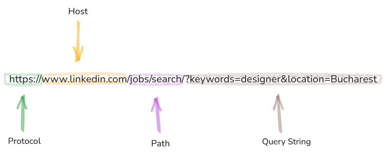
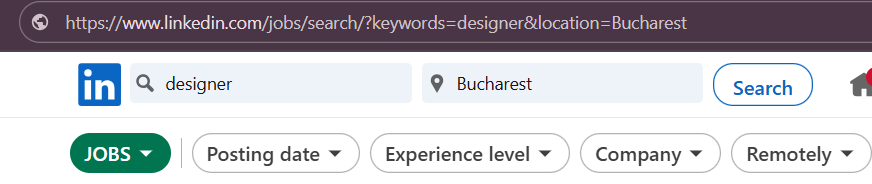

## 1. Overview

In this article, we’ll break down the request URL and its main parts — protocol, host, path, and query string.

Then, we’ll take a closer look at path and query parameters — what they do, how they’re used, and the key differences between them.

## 2. The URL

 The URL (Uniform Resource Locator) is the address of a web page or resource on the internet. It tells your browser where to go.

A URL has a few key parts:

- **Protocol** – How the data is sent (e.g., `http` or `https`)
- **Host** – The domain name (e.g., `www.linkedin.com`)
- **Path** – Shows which page or resource you want (e.g., `/jobs/search/`)
- **Query String** – Comes after `?` and sends extra info using key-value pairs (e.g.,`?keywords=designer&location=Bucharest`)

## 3. Path Parameters

Path parameters are parts of a URL used to identify specific resources. They act as placeholders within the URL path and are replaced with real values when making a request.

 These values help the server determine which exact item or resource to return, such as a specific user, product, or post. Path parameters are essential for building dynamic URLs in web applications and APIs.

## 4. Query Parameters
Query parameters are used to send extra information in a URL. They come after the ? and follow the format key=value.

They’re often used for searches, filters, or sorting.
In our example, we filtered the jobs using the keywords *"designer"* and the location *Bucharest*. This resulted in a query string having two key-value pairs: `?keywords=designer&location=Bucharest`

Now that we understand how URLs and their parameters work, let’s see why this knowledge is valuable for QA testing.

## 5. How is this helping me as a QA?
For QA, understanding URLs helps test real user behavior, ensures data accuracy, and catches edge cases that can affect user experience or security.

- **Test Search Accuracy:**
Are only designer jobs shown? Are results limited to Bucharest?

- **Boundary Testing:** 
What happens if the keywords is empty? What if the location is misspelled or missing?

- **URL Manipulation:**
Can a user change the URL manually and get valid results or break the page?

- **Automation:**
This URL can be used in automated tests to check if filters/search results work correctly.

## 6. Conclusion

In this article, we discussed the key parts of a URL — protocol, host, path, and query string — and took a closer look at how path and query parameters work. 

Understanding these elements helps you navigate the web, interact with APIs, and test web features more effectively. Whether you're building, testing, or just browsing, knowing how URLs function gives you greater insight and control over how web applications behave.
